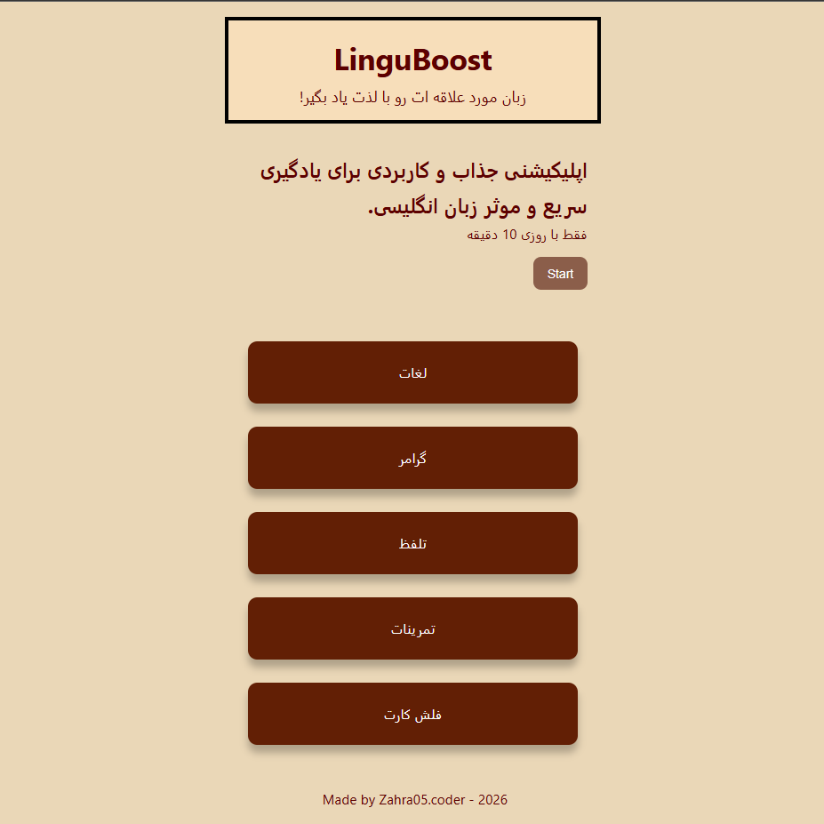
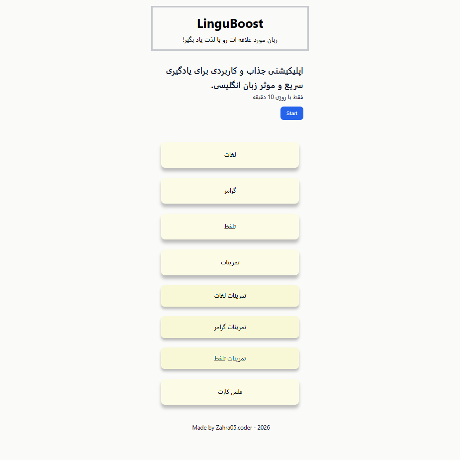
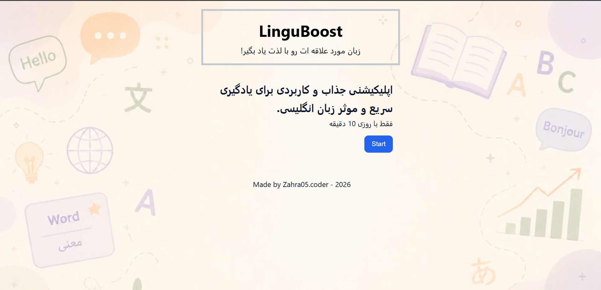

# Changelog

# 📢 Update 06/07/2026

## Create a dashboard.

Dashboard content:

Vocabulary. Grammar. Pronunciation. Exercises: vocabulary exercises. grammar exercises. pronunciation exercises. flashcards.

## Dashboard

# 📢 Update 06/08/2026

Change whole style.

Enabled the Exercises button.

Exercise categories are now displayed when the user clicks on the Exercises section.

## Exercises

# 📢 Update 06/13/2026

Add background.

## Background

Add icons for header, description, dashboard.

Edit dachboard styles.

# 📢 Update 06/14/2026

Changing the Start Button Style.

Changing the header text.

Styling the header text.

# 📢 Update 06/15/2026

Add background for tablets.

Add media query.

# 📢 Update 06/21/2026

Add github link in footer.

Add style for github link in footer.

Change some icons.

# 📢 Update 06/23/2026

Add responsive for mobiles.

# 📢 Update 06/28/2026

Install Node.js.

Install TailwindCSS v4.

# 📢 Update 07/04/2026

Add dist & src file.

Create two file for tailwindcss in dist (style.css) and src (input.css).

# 📢 Update 07/05/2026

Change CSS codes to Tailwind.

# 📢 Update 07/06/2026

Center the icon and the hero section.

Reduce the font size.

Make the cards smaller.

Center the text inside the cards.

Make the form smaller.

Center the footer.

Add spacing between the cards.

# 📢 Update 07/18/2026

Enable the Start, Done, Next button
